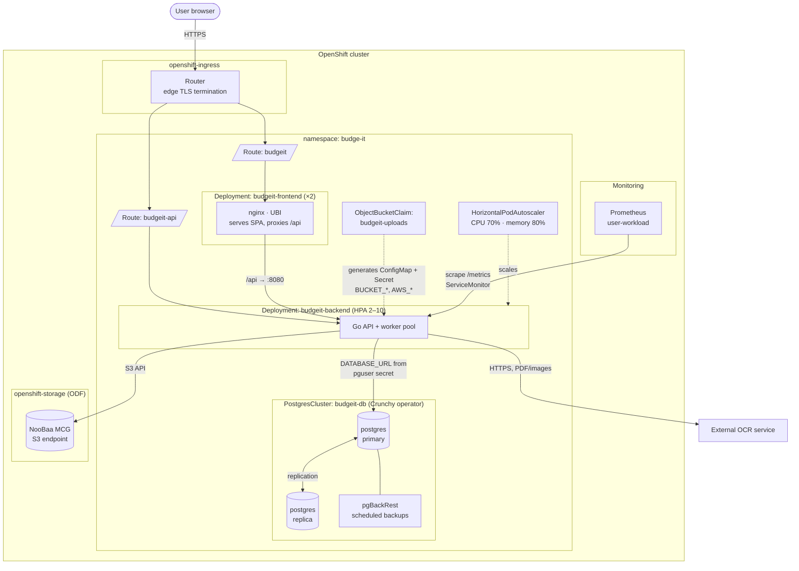
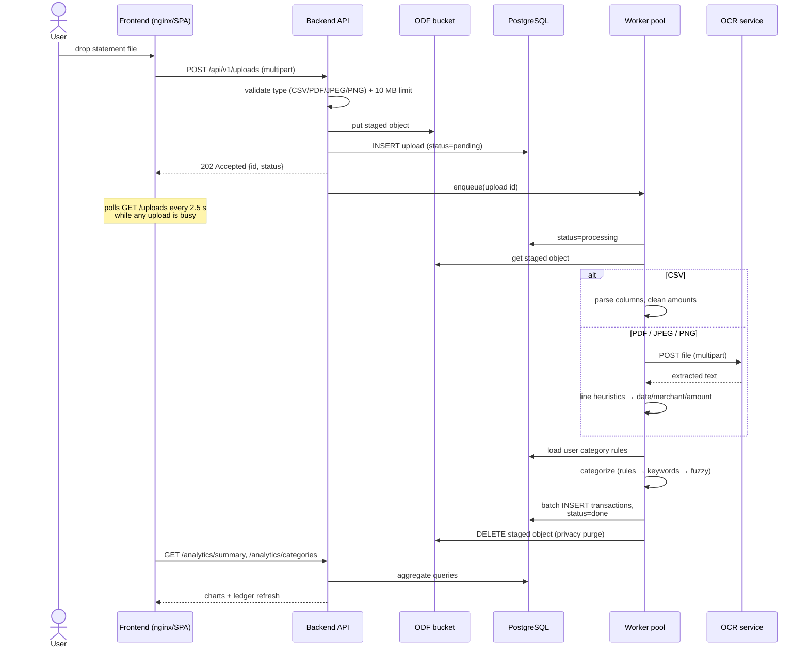
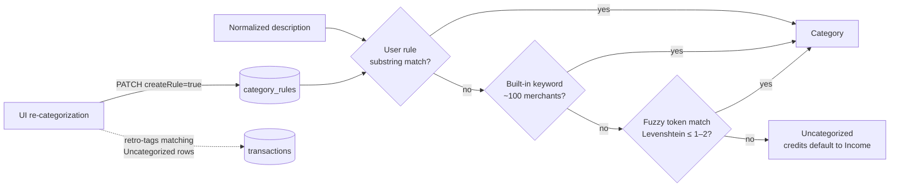
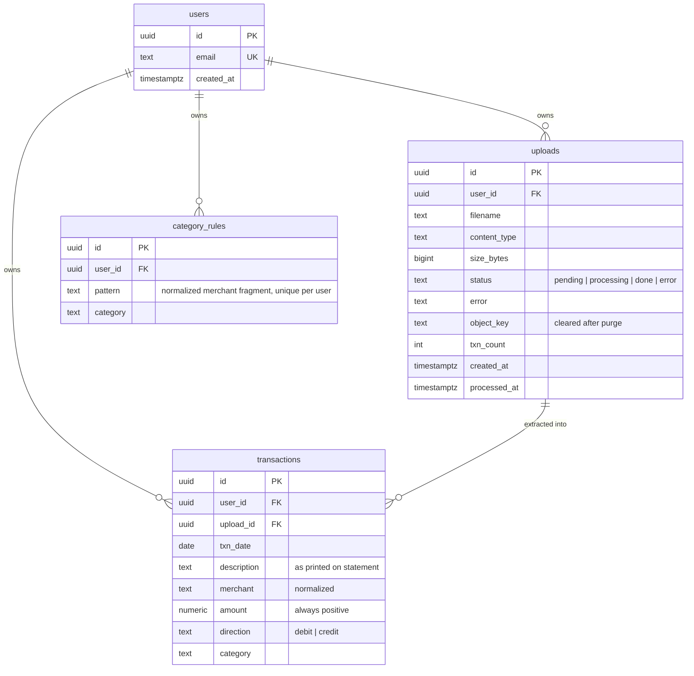
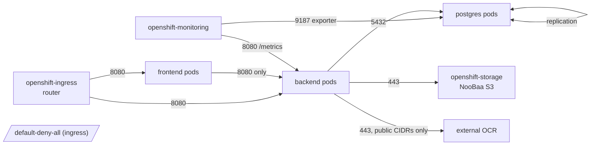
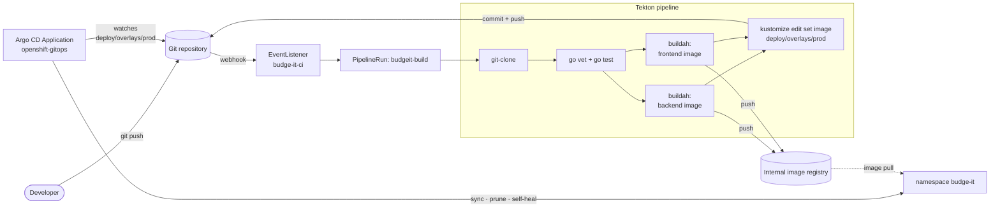

# Budge-it — Architecture

This document describes how Budge-it is put together: the runtime topology on
OpenShift, the statement-processing pipeline, the data model, the network
security contract, and the CI/CD flow. The product requirements are in
[PRD.md](PRD.md).

## 1. Runtime topology (OpenShift)

Everything below the Routes is declared in `deploy/base/` and applied per
environment through the Kustomize overlays in `deploy/overlays/`.

Key wiring details:

- The **Crunchy operator** turns the single `PostgresCluster` CR into an HA
  pair with scheduled pgBackRest backups, and generates the secret
  `budgeit-db-pguser-budgeit`; the backend reads its `uri` key as
  `DATABASE_URL`.
- The **ObjectBucketClaim** makes ODF provision an S3 bucket and emit a
  ConfigMap (`BUCKET_HOST/PORT/NAME`) plus Secret (`AWS_ACCESS_KEY_ID`,
  `AWS_SECRET_ACCESS_KEY`), both mounted into the backend via `envFrom` — no
  hand-managed storage credentials.
- The **HPA owns the backend replica count** (the Deployment declares none,
  and the Argo CD Application ignores replica drift on it).
- Both containers run under the **restricted SCC**: non-root, no privilege
  escalation, all capabilities dropped, read-only root filesystem on the
  backend, and no service-account tokens mounted.

## 2. Statement processing pipeline

Uploads return `202 Accepted` immediately; extraction happens on an
in-process worker pool (default 4 workers, `WORKERS` env). Jobs interrupted
by a pod restart are recovered on startup by re-enqueuing every upload still
marked `pending`/`processing`.

### Categorization engine

Three tiers, first match wins; descriptions are normalized first
(uppercase, punctuation collapsed: `AMZN*Mktplace-0442` → `AMZN MKTPLACE 0442`).

Re-categorizing in the UI persists a rule keyed on the merchant, so the
correction applies to every future statement — and immediately retro-tags
existing uncategorized transactions for the same merchant.

## 3. Data model

Schema lives in `backend/internal/db/migrations/` (embedded in the binary and
applied on startup, tracked in `schema_migrations`). A single default user is
seeded until authentication lands; every query is already scoped by
`user_id`, so adding auth is a matter of swapping the subject in
`api.userID()`.

## 4. Network security contract

`deploy/base/networkpolicies.yaml` enforces the PRD's traffic rules with a
default-deny ingress baseline. Arrows below are the **only** allowed flows.

Notes:

- Frontend egress is restricted to DNS + the backend; it cannot reach the
  database or the bucket at all.
- Backend egress to the OCR service allows public HTTPS only (RFC-1918
  ranges excluded); tighten it to a specific `ipBlock` or in-cluster selector
  once the OCR endpoint is fixed.
- ServiceAccounts carry **no RBAC grants** and do not mount API tokens —
  neither workload talks to the Kubernetes API.

## 5. CI/CD and GitOps

Build and deploy are decoupled: Tekton produces images and bumps the prod
overlay; Argo CD is the only thing that touches the cluster.

- Both images build from **Red Hat UBI** bases (Go toolset → UBI minimal;
  Node.js toolset → UBI nginx) so they run unprivileged under the restricted
  SCC.
- The prod overlay pins image tags; promotion is a Git commit, so every
  rollout is auditable and revertible with `git revert`.
- Dev and prod share the same Kustomize base; dev patches replica counts and
  runs a single-instance database (`deploy/overlays/dev`).

## 6. Observability

- The backend exposes `/metrics` (Prometheus format), scraped through the
  `ServiceMonitor` by user-workload monitoring / the Cluster Observability
  Operator.
- Application metrics: `budgeit_http_request_duration_seconds` (per route,
  method, status), `budgeit_uploads_total`, `budgeit_processing_jobs_total`
  (by outcome), `budgeit_processing_job_duration_seconds`,
  `budgeit_transactions_extracted_total`, `budgeit_processing_queue_depth`,
  plus Go runtime metrics.
- PostgreSQL health comes from the Crunchy `pgmonitor` exporter enabled on
  the `PostgresCluster` CR (port 9187, allowed by NetworkPolicy).
- Probes: `/healthz` (liveness) and `/readyz` (readiness, pings the
  database) drive the Deployment rollout and Route backends.
