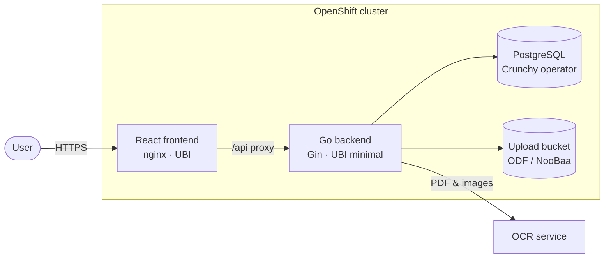

# Budge-it

Upload bank and credit-card statements (CSV, PDF, JPEG, PNG), get an automatic
ledger, spending categories, and visual analytics. Built to run natively on
Red Hat OpenShift with operator-managed dependencies.

See [PRD.md](PRD.md) for the product requirements and
[ARCHITECTURE.md](ARCHITECTURE.md) for detailed design diagrams.

## At a glance



- **CSV** statements are parsed directly (signed Amount or Debit/Credit
  columns, flexible date formats, currency-symbol/asterisk cleaning).
- **PDF/JPEG/PNG** go through the OCR service configured by `OCR_ENDPOINT` /
  `OCR_API_KEY`, then line heuristics extract date/merchant/amount.
- Categorization: user rules (created automatically when you re-categorize in
  the UI) → built-in merchant keywords → fuzzy matching for abbreviations
  like `AMZN MKTPLACE`.
- Uploaded files are **staged only**: the worker purges the object from the
  bucket immediately after extraction.

## Repository layout

| Path | What it is |
|---|---|
| `backend/` | Go (Gin) API: uploads, async extraction workers, categorization engine, analytics, Prometheus metrics. UBI-based Dockerfile. |
| `frontend/` | React + Vite dashboard: drag-and-drop upload with progress, KPI tiles, monthly in/out chart, category breakdown, transaction table with persistent re-categorization. UBI nginx Dockerfile. |
| `deploy/base/` | Kustomize base: Crunchy Postgres Operator install (OLM `OperatorGroup`/`Subscription`), `PostgresCluster`, `ObjectBucketClaim` (ODF/NooBaa), Deployments, Services, edge-TLS Routes, ServiceAccounts, ConfigMap/Secret, NetworkPolicies, HPA, ServiceMonitor. |
| `deploy/overlays/{dev,prod}` | Environment overlays (dev: single replicas, no HA). |
| `deploy/ci/` | GitOps-managed CI: OpenShift Pipelines operator install, `budge-it-ci` namespace, clone → test → Buildah build Pipeline, webhook Triggers + EventListener Route, registry-push RBAC. |
| `tekton/` | Example manual `PipelineRun` for kicking off a build by hand. |
| `argocd/` | OpenShift GitOps `Application`s: `budge-it` syncing `deploy/overlays/prod`, `budge-it-ci` syncing `deploy/ci`. |
| `examples/` | Sample CSV statement for a quick demo. |

## Local development

Requires Go 1.24+, Node 20+, and Docker or Podman.

```sh
make dev-deps     # local PostgreSQL 16 + MinIO (stands in for ODF)
make backend      # Go API on :8080
make frontend     # Vite dev server on :5173 (proxies /api)
```

Then open http://localhost:5173 and drop `examples/sample-statement.csv` on
the upload zone. Run tests with `make test`.

## Deploying to OpenShift

Prerequisites (installed cluster-wide, outside this repo's GitOps scope):
OpenShift Data Foundation (with the Multi-Cloud Object Gateway), OpenShift
GitOps, and user-workload monitoring enabled for the ServiceMonitor. ODF is
cluster-wide shared storage, so it's kept out of `deploy/` deliberately —
the main Application runs `prune: true`, and owning a shared platform
operator there would risk Argo deleting it for everyone if the app were
ever removed.

The **Crunchy Postgres Operator**, by contrast, is scoped to just this
namespace, so it *is* GitOps-managed (`deploy/base/operators.yaml`) — no
manual install step needed. **OpenShift Pipelines** is also GitOps-managed,
but through its own Application (`argocd/ci-application.yaml` →
`deploy/ci/`) with pruning off, so removing the budge-it app can never
uninstall Tekton for the rest of the cluster.

1. **Manifests** — render or apply directly:
   ```sh
   kubectl kustomize deploy/overlays/prod   # inspect
   oc apply -k deploy/overlays/prod         # direct apply (or let Argo CD do it)
   ```
2. **GitOps** — point `argocd/application.yaml` at your fork and apply it to
   the `openshift-gitops` namespace. Argo CD then owns the `budge-it`
   namespace with automated sync/prune/self-heal.

   Resources are staged into phases with `argocd.argoproj.io/sync-wave`
   annotations so dependencies land before what needs them:
   `-2` Namespace → `-1` ServiceAccounts/ConfigMap/Secret/operator install →
   `0` `PostgresCluster`/`ObjectBucketClaim` (need the operator's CRD and the
   ODF storage class) → `1` Deployments/Services/Routes/HPA/NetworkPolicies/
   ServiceMonitor (need the secrets the operator and OBC generate). Argo's
   configured `retry`/`backoff` lets a wave that fails while OLM is still
   installing the operator's CRD self-heal on its own instead of stalling.
3. **CI** — apply `argocd/ci-application.yaml` to `openshift-gitops`. It
   installs the OpenShift Pipelines operator (OLM Subscription in
   `openshift-operators`) and owns the `budge-it-ci` namespace with the
   build Pipeline, Triggers, EventListener, and a RoleBinding letting the
   CI `pipeline` serviceaccount push images into the `budge-it` registry
   namespace. Builds are triggered by the `budgeit-commit-poller` CronJob,
   which polls GitHub for new commits on main every two minutes and feeds
   the EventListener — polling because this cluster sits on a private LAN
   that GitHub's webhook servers can't reach. (If your cluster is publicly
   reachable, point a GitHub push webhook at the `budgeit-ci-webhook` Route
   instead and delete the poller.) A build can also be kicked by hand with
   `oc create -f tekton/pipelinerun-example.yaml`. Builds run tests, produce
   both UBI images with Buildah pushed as `:latest` plus the commit-SHA tag,
   and restart the Deployments so the new images roll out.
4. **Secrets** — replace the `budgeit-secrets` placeholder (`OCR_API_KEY`)
   with a real value; the database URI and S3 credentials are generated by
   the Crunchy operator and the ObjectBucketClaim respectively and consumed
   via `envFrom`/`secretKeyRef`.

Security posture: both pods run non-root under the restricted SCC
(`runAsNonRoot`, no privilege escalation, all capabilities dropped, read-only
root FS on the backend, no service-account token mounts), and NetworkPolicies
enforce router → frontend → backend → {PostgreSQL, ODF, OCR} with default-deny
ingress. The backend HPA scales 2–10 replicas on CPU/memory for batch OCR load.

## API

| Method & path | Purpose |
|---|---|
| `POST /api/v1/uploads` | Multipart upload (validates type + 10 MB limit), returns `202` and processes asynchronously |
| `GET /api/v1/uploads` | Upload history with processing status |
| `GET /api/v1/transactions?month=YYYY-MM&category=` | Ledger with filters |
| `PATCH /api/v1/transactions/:id` | Re-categorize; `{"createRule": true}` persists a merchant rule and retro-tags |
| `GET /api/v1/analytics/summary` | Totals plus monthly inflow/outflow series |
| `GET /api/v1/analytics/categories?month=` | Spending totals by category |
| `GET /api/v1/categories`, `GET /api/v1/rules` | Category list, saved rules |
| `GET /healthz`, `/readyz`, `/metrics` | Probes and Prometheus metrics (`budgeit_*`) |
